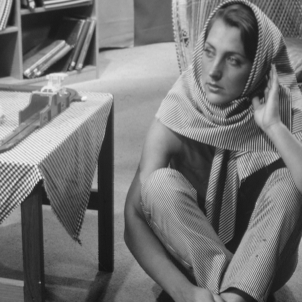
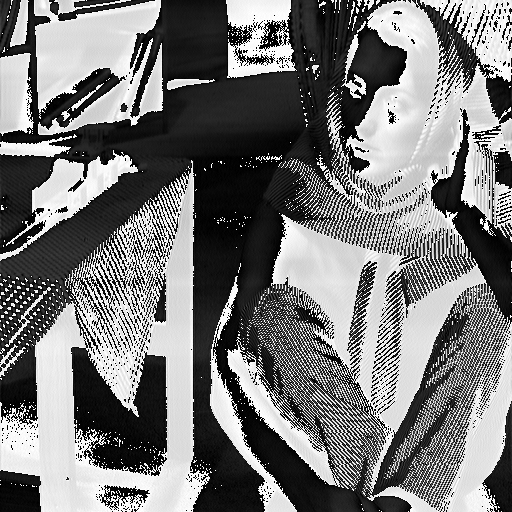

# Description
This program runs an images rows through a discrete fourier transform and then runs a high pass filter on the data before using an inverse fourier transform to convert the data back to grayscale. Multithreading is utilized. This program only supports .pgm images.

# Command Arguments
`-f <filename>` must be used to tell the program what file to perform the processing on.

`-t <thread_count>` is optional and defines the number of threads the program will use. If no `-t` tag is used it will default to 4 threads.

# Running the Program
`make` can be used to compile the project into the executable `main.out`

The output file is `myFileOut.pgm`

`barbara.pgm` is included in the repo for ease of testing.

### Original Image:

### Output Image:
